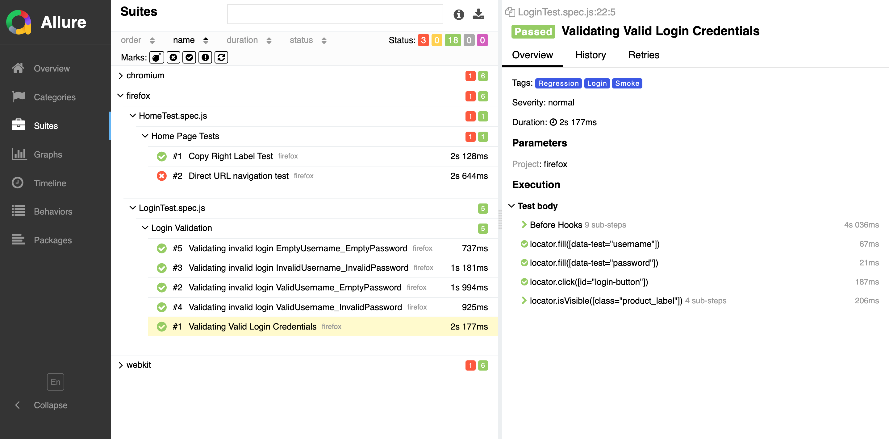
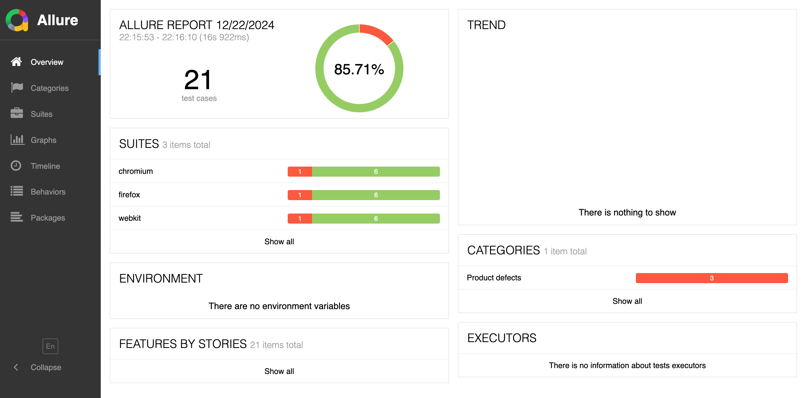
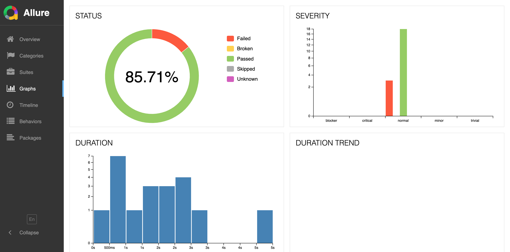

# saucedemo-automation-playwright

# Work in progress

## Running Tests


## Test Reports

The project uses Allure for test reporting. After running the pageTests, you can generate the Allure reports using the following command:

1. **Generate Allure report:**
    ```sh
    allure report
    ```

2. **Open Allure report:**
    ```sh
    allure serve allure-results 
    ```
   or
   ```shell
   allure serve
   ```

3. **To save report in a single file with report name**
   ```shell
   allure generate -c --single-file allure-results --report-name
   ```

### Report Screenshots

|  |  |
| ----- | ------ |
|  |     |
|  |    |

https://www.saucedemo.com/v1/